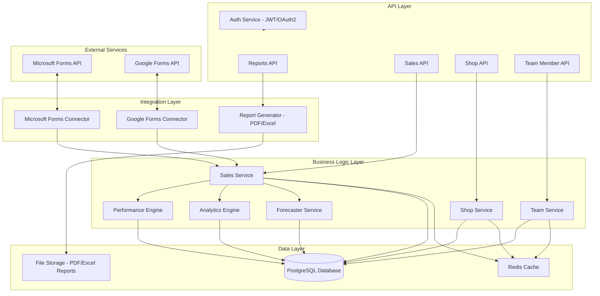

# M-Kopa AOIS - API & Backend Architecture

This document represents the technical architecture of the API and Backend layers for the M-Kopa Accra Operations Intelligence System (AOIS), as derived from the system's technical specifications.

## 1. System Architecture Diagram

The following diagram illustrates the layered structure of the system, showing the interaction between external services, the integration layer, business logic, and the data storage layer.

## 2. Layer Descriptions

### 2.1. API Layer
The entry point for the frontend application. It exposes specific endpoints for different business domains and handles security through the **Auth Service** using JWT or OAuth2.

### 2.2. Integration Layer
Responsible for communication with external platforms.
*   **Connectors**: Sync data from Google and Microsoft Forms into the internal Sales Service.
*   **Report Generator**: Handles the creation of PDF and Excel documents for export.

### 2.3. Business Logic Layer
The core intelligence of the system.
*   **Engages/Engines**: The Performance, Analytics, and Forecaster engines process raw data into management insights.
*   **Domain Services**: The Sales, Shop, and Team services manage the primary business entities and logic.

### 2.4. Data Layer
The foundation for data persistence and performance.
*   **PostgreSQL**: The primary relational database for all operational and historical data.
*   **Redis Cache**: Used for high-speed data retrieval to ensure a responsive user experience.
*   **File Storage**: A dedicated storage area for generated reports and static assets.
